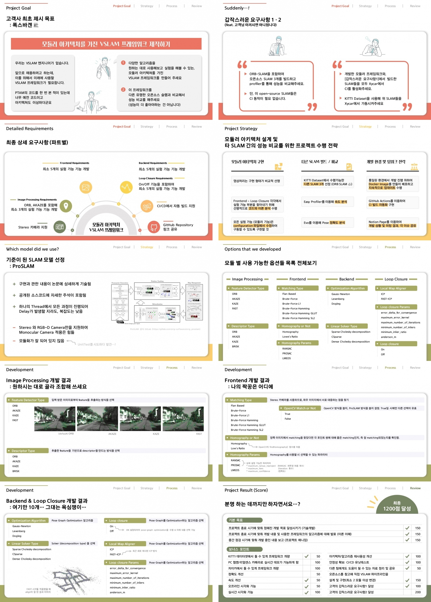

# SLAM PoC Project

## Overview
본 레포지토리는 프로그래머스 자율주행 데브코스 3기의 SLAM 프로젝트 결과물을 저장하고 있다. 보고서 및 발표자료는 `report` 폴더에서 확인할 수 있다.



## Directory Tree
```
├─ .github/workflows            (github actions 관련 파일)
│   ├─ base_image.yml           (docker image를 만듦 (작동X))
│   ├─ build.yml                (build)
│   ├─ build_arm64.yml          (build in arm64 architecture (작동X))
│   ├─ clang-tools.yml          (clang에 맞추어 포맷팅 (작동X))
│   ├─ run_slam.yml             (Xycar에서 SLAM 자동 수행 (작동X))
│   └─ unit_test.yml            (Unit Test를 실행)
│
├─ configurations/              (각 데이터셋에 대한 설정 파일)
│
├─ dockerfiles/                 (docker 작동을 위한 dockerfile)
│   ├─ base.dockerfile          (기본적 docker image를 만듦)
│   ├─ build.dockerfile         (자동 빌드 수행)
│   ├─ run.dockerfile           (Xycar에서 SLAM 자동 수행 (작동X))
│   └─ unit_test.dockerfile     (Unit Test를 실행)
│
├─ executables/                 (실제 실행을 위한 코드)
│
├─ report/                     (중간 및 최종 보고서, 발표자료)
│
├─ src/                         (소스코드)
│
├─ .clang-format
├─ .gitignore
├─ run-clang-format.py          (전체 파일에 대해 clang formatting을 수행)
└─ README.md
```

## Docker files
### Image 받아 실행하기
1. 도커 설치 & 로그인까지 다 된 이후라고 가정합니다.
2. 도커 이미지를 다운받는다.
   1. 이미지 pull하기: `docker pull 717lumos/proslam:data`
   2. 이미지 확인하기: `docker images`
3. 도커 컨테이너를 만든다
   1. 컨테이너 생성 명령어 입력하기 (--name 태그 뒤에 있는 proslam_data_devel 은 컨테이너의 이름으로, 본인이 변경하셔도 상관 없고, [--name <이름>] 부분은 쓰지 않으셔도 됩니다.) → 실행을 하고 나면 사용자가 `root@b6d38b3729c8:/#` 식으로 바뀔 겁니다
        ```bash
        docker run -it -v /tmp/.X11-unix:/tmp/.X11-unix -e DISPLAY=unix$DISPLAY --name proslam_data_devel 717lumos/proslam:data
        ```
    2. 다른 터미널을 열어 컨테이너 실행 확인하기 → 확인 후 종료해도 됩니다.: `docker ps`
4. GUI 테스트를 위해 설정 몇 가지 추가한다. **(컨테이너 밖에서 진행!!)**
   1. 설치→ 마지막 명령어를 치면 눈깔 두 개가 나올 겁니다. 확인하고 끄세요
    ```bash
    sudo apt-get update
    sudo apt-get install x11-apps
    xeyes
    ```
   2. 사용자 추가
    ```bash
    xhost +local:docker
    ```

## VSCode와 연동하기
1. VSCode에 원격 연결 확장 프로그램(`Remote Development`)을 설치한다.
2. VSCode와 컨테이너를 연결한다.
    1. `Ctrl + Shift + P` 를 눌러 검색창이 뜨면 `Attach to Running Container...`을 검색해 선택한다.
    2. 목록 중에 내가 실행중인 컨테이너를 선택한다.
    3. 새 창이 열리며 좌하단에 컨테이너 실행중이라는 표시가 뜬다.
    4. 좌측 창에서 Open Folders 를 눌러 원하는 레포지토리를 선택해 파일 탐색기를 설정한다.
    5. 터미널 창이 없다면 [상단 메뉴바 Terminal - New Terminal]로 연다.
3. 디렉터리 구성 (사용하는 것만 표시)
    
    ```
    /root/
    ├─ catkin_ws/  [Catkin Workspace]
    │ ├─ build/
    │ ├─ devel/
    │ │ └─ lib/
    │ │ 	└─ srrg_proslam/
      │  		├─ app       [ProSLAM 실행파일]
    │ │ 		└─ test_app  [ProSLAM 유닛테스트 실행파일]
    │ └─ src/
    │ 	├─ CMakeLists.txt  
    │ 	├─ ORB_SLAM2/           [ORB SLAM2 소스코드]
    │ 	├─ Pangolin-0.6/        [ORB SLAM2에 필요한 라이브러리 Pangolin 0.6ver]
    │ 	├─ easy_profiler/       [속도 측정 툴 easy profiler]
    │ 	├─ g2o_catkin/          [ProSLAM에 필요한 Solver 라이브러리 G2O]
    │ 	├─ srrg_cmake_modules/  [ProSLAM 라이브러리]  
    │ 	├─ srrg_core/           [ProSLAM 라이브러리]  
    │ 	├─ srrg_core_viewers/   [ProSLAM 라이브러리]  
    │ 	├─ srrg_gl_helpers/     [ProSLAM 라이브러리]  
    │ 	├─ srrg_hbst/           [ProSLAM 라이브러리]  
    │ 	└─ srrg_proslam/        [ProSLAM 소스코드]  
    ├─ dataset/         [각 SLAM에 필요한 데이터셋 & GT 데이터]
    │ ├─ KITTI_ORB/   [ORB SLAM2에 사용할 KITTI 데이터셋]
    │ └─ KITTI_Pro/   [ProSLAM에 사용할 KITTI 데이터셋]
    └─ test_results/    [각 SLAM의 결과 (편집 GT데이터, profiler, trajectory 결과, 정확도 지도)]
    	├─ ORB_SLAM/  [ORB SLAM2 결과물]
    	│ ├─ 00_gt_edited.txt      [2000 frame의 GT 데이터]
    	│ ├─ CameraTrajectory.txt  [SLAM 결과의 경로]
    	│ ├─ ORB_SLAM_accuracy.png [GT vs SLAM결과 비교 이미지]
    	│ ├─ ORB_SLAM_profile.prof [속도 측정 profiler 결과]
    	│ └─ memo.txt              [기타 메모사항]
    	└─ ProSLAM/   [ProSLAM 결과물]
    		├─ 00_gt_edited.txt      [2000 frame의 GT 데이터]
    		├─ ProSLAM_accuracy.png  [GT vs SLAM결과 비교 이미지]
    		├─ ProSLAM_profile.prof  [속도 측정 profiler 결과]
    		├─ memo.txt              [기타 메모사항]
    		├─ trajectory_kitti.txt  [SLAM 결과의 경로 (kitti 형식)]
    		└─ trajectory_tum.txt    [SLAM 결과의 경로 (tum 형식)]
    ```
4.  설정해둔 alias들
    | alias | command | description|
    |---|---|---|
    | test_build | `cd ~/catkin_ws/src && catkin build --make-args tests -- srrg_proslam` | 프로슬램 + 테스트 빌드 |
    | src_build | `cd ~/catkin_ws/src && catkin build srrg_proslam` | 프로슬램 빌드 |
    | src | `cd ~/catkin_ws/src/srrg_proslam` | 프로슬램 폴더로 이동 |
    | runtest | `cd ~/catkin_ws/devel/lib/srrg_proslam && ./test_app` | 유닛테스트 작동 |
    | rungui | `cd ~/dataset/KITTI_Pro && ~/catkin_ws/devel/lib/srrg_proslam/app -c ~/catkin_ws/src/srrg_proslam/configurations/configuration_kitti.yaml -use-gui` | 프로슬램 구동 |
    | easy_profiler | `~/catkin_ws/src/easy_profiler/build/bin/profiler_gui` | profiler 작동 |
    | runorb | `cd ~/catkin_ws/src/ORB_SLAM2 && ./Examples/Stereo/stereo_kitti Vocabulary/ORBvoc.txt Examples/Stereo/KITTI00-02.yaml ~/dataset/KITTI_ORB` | ORB 구동 |
